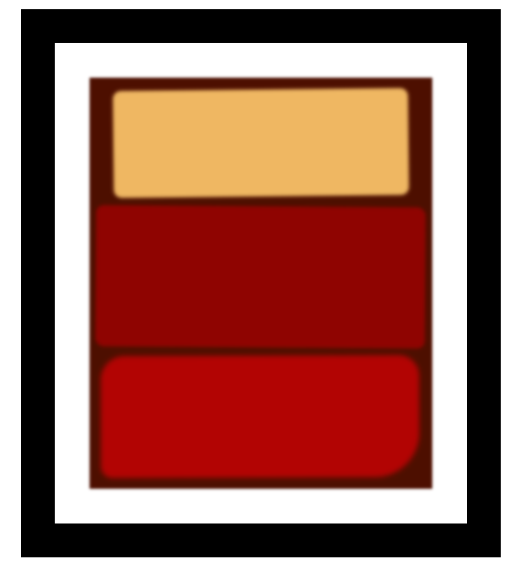

# Box Model - Rothko Paiting

🔗 [Click here to access](https://carvmi.github.io/boxmodel/)

## Technologies 
- HTML
- CSS

## What I have learned
- How to use css properties to distinguish divs classes
- Some of the properties applied include: box-shadow, transform, border-radius and filter

## Contact
milenadecarvalho2000@gmail.com
